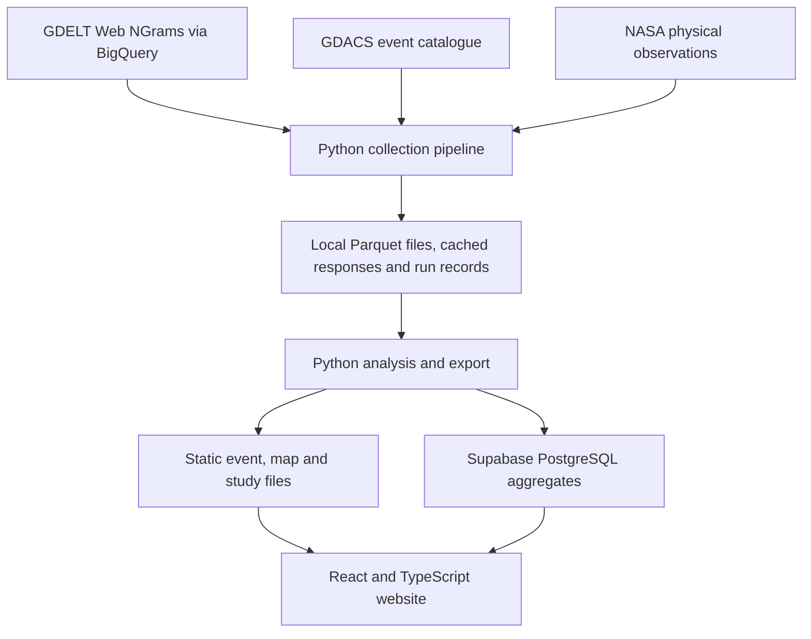

# Climate Attention Atlas — T&E technical call briefing

Prepared 15 September 2026 for the call on 16 September 2026. This is a dated
repository review, not a verification of live hosting, billing or external backups.

The Atlas is a working research prototype with a reusable collection pipeline.
The agreed UK pilot will be owned by **T&E**, with coordinated data updates,
measurement validation and a more general topic/event model.

## Opening explanation

> The Atlas collects news and independently recorded events in batches, stores an
> auditable research dataset, and prepares aggregates for an interactive website.
> The current demonstration uses climate-change and EV phrases around wildfires
> and floods. The next phase is to validate those measurements, broaden the sources
> and questions, and automate operation under organisational ownership.

## Architecture at a glance

| Layer | Current implementation | Purpose |
| --- | --- | --- |
| Collection | Python CLI; BigQuery for NGrams; provider adapters for GDACS and NASA | Collect independently measured news and event/physical observations in batches. |
| Research archive | Local Parquet, cached responses, frozen configurations and run manifests | Retain research inputs, match evidence and provenance; resume interrupted runs. |
| Analysis | Python event-study and export code | Prepare event comparisons and aggregate tables. |
| Serving | Static JSON/GeoJSON plus Supabase PostgreSQL | Supply maps, major-event studies, daily attention and all-alert analyses. |
| Website | React, TypeScript and Vite; configured for Netlify | Explore existing results; opening the site does not collect fresh data. |

There is no custom continuously running application backend. BigQuery performs the
large news searches; Supabase serves prepared data. Google Trends is an experimental
collector, not a current event-study outcome. Official Google Trends integration,
social-post collection, geopolitical trackers and prediction are future work.

## 1. Supabase is required for the full current experience

Earlier documentation described it as optional. Collection and analysis can operate
locally without it, but the current website expects Supabase for daily attention and
several analysis views. Static files provide maps, events and major-event studies;
they are not a complete offline substitute.

This split keeps database queries and browser downloads manageable, but introduces
two serving paths. See [app loading](../frontend/src/App.tsx) and
[Supabase access](../frontend/src/supabase.ts).

## 2. There is no single coordinated data release

Collection, analysis, static export, database synchronization and website deployment
are separate operations. A Netlify build does not refresh source observations.
Static studies and remote tables can therefore represent different snapshots.

Daily-attention sync uses batch transactions; the derived warehouse replaces each
table's selected year in a separate transaction. There is no atomic release across
all tables and static files, or shared dataset-version check in the browser.

The [September 10 synchronization](IMPROVEMENTS_PHASE1.md) was documented as verified
against local data. Snapshot inconsistency is an architectural risk, not a finding
that today's live deployment is inconsistent. A future release process should
prepare and validate a complete dataset, then publish one identified version.

## 3. The canonical research archive is local

Supabase holds selected serving aggregates. Local Parquet holds the main research
records, including retained article metadata and phrase-match evidence. The local
`data` directory occupied about 3.2 GB when reviewed; browser data assets about 22 MB.

Resumable runs, frozen configurations and response caches are strengths. No
repository-managed production scheduler or backup/restore procedure was found.
External arrangements may exist and were not verified. Source rasters are not all
archived: the MODIS vegetation workflow deletes temporary downloaded subsets.

Atomic file replacement helps interrupted writes, but does not provide concurrency
locking. Multiple jobs should not update the same Parquet partitions simultaneously.
Agree an archive owner, managed job runner, failure-alert recipient and recovery
procedure before routine organisational operation.

## 4. Read-only aggregates are not private aggregates

The database migrations allow anonymous reads of the serving tables and deny browser
writes. The browser uses a publishable key; privileged database credentials remain
outside the frontend. No staff login or T&E-specific access policy is implemented.

This supports a public aggregate dashboard. Restricting the website alone would not
restrict the database endpoints. Article-level serving was deliberately removed;
detailed article records remain local. Live access settings were not rechecked.
See the [serving policies](../supabase/migrations/20260823190000_create_analysis_lab.sql).

## 5. Configuration is more flexible than the full platform

The collector accepts configurable topic phrase lists. Analysis constants, database
constraints and frontend types still explicitly encode climate change/EVs,
wildfires/floods and selected windows. Export and initial loading paths explicitly
name 2025 and 2026.

Adding another topic or an oil-price/COP tracker therefore needs coordinated changes
through analysis, serving and display, not just YAML edits. Google Trends needs an
official connector plus an analysis path preserving search-interest semantics and
scaling. The existing collector does not make this a simple credential switch.

Shared topic/event definitions and a general event model would make extension
easier. This does not require a wholesale rewrite. See
[analysis definitions](../src/climate_attention/event_study.py) and the
[database schema](../supabase/migrations/20260823190000_create_analysis_lab.sql).

## 6. Measurement uses phrases and explicit cost–coverage trade-offs

No LLM or trained semantic classifier decides article relevance. The pipeline uses
configured original-language phrases; political flags use phrase and official-domain
rules. It does not measure sentiment, endorsement, persuasion or public opinion.

BigQuery scans batch topics/countries and have dry-run estimates and per-job byte
limits. Anchor-token choices reduce scanning but can miss some case and punctuation
variants. These are accuracy trade-offs to validate, not simply implementation details.

Publishing-country attribution substantially relies on a 2015 domain-country map.
Country news denominators are optional and not validated for routine use. More
matched URLs can reflect more total publishing or changing source coverage. Local
language review alone cannot resolve those issues. URL deduplication also does not
identify syndicated copies of the same story published at different URLs.

Changing a topic's scope may require a new historical BigQuery scan: retained
matched articles are not a complete archive of previously unmatched news.

## 7. Provenance does not yet provide immutable dataset versions

Revised phrase definitions can replace canonical measurements for the same topic
and date. Earlier configurations and response records are retained, but analysis
tables do not expose each definition as a separately selectable dataset version.

**Open implementation issue, reproduced synthetically on September 15:** a revised
NGram record with a new count can retain an old share or political count when the
incoming field is null. For example, changing matched count from 10 to 20 while
omitting new share/political fields retained the previous share of 0.1 and political
count of 4. This follows the current non-null merge rule in
[storage.py](../src/climate_attention/storage.py).

This is not evidence that stored results are affected. The implementation and any
affected records need review before systematic phrase revisions or mixed collection
modes. The documentation correction accompanying this briefing does not fix this bug.

## 8. Prediction needs information available at prediction time

Event storage prefers the latest provider revision. This is useful for retrospective
exploration, but final severity and revised event end dates may be unknown when a
prediction would have been made. Holding out later dates does not prevent leakage
if the features contain that future information.

The predictive phase should preserve event revisions and their availability times,
then construct features using only information available at each prediction date.
Current before/after changes and lead/lag correlations remain descriptive.

## Documentation corrections following this review

The README, methodology, operations guide, data dictionary, one-pager and in-app
Methods wording have been reconciled with the current primary NGram outcome,
Supabase dependency and descriptive analyses. The obsolete permutation-test
reference was removed from the current Methods page. Translation-status labels are
distinguished from measured classifier accuracy.

Historical review and improvement reports retain their dated findings and test
counts as an audit trail. The architectural gaps above remain open unless explicitly
identified as documentation corrections.

## Decisions agreed or to confirm with T&E

- **Ownership:** T&E will own the repository. Confirm which T&E accounts should own
  hosting, database, BigQuery billing, credentials, the research archive and Google
  Trends access.
- **Access:** should aggregates be public or restricted to staff?
- **Pilot scope:** which topics, languages, countries and non-weather event types
  should be supported first?
- **Operations and validation:** who runs refreshes, reviews language accuracy,
  approves dataset releases, handles failures and verifies recovery?

## Verification and limits

On September 15, 118 Python tests and 49 frontend tests passed. They verify
implemented behaviour, not classifier accuracy, production reliability or causal
validity. The merge issue above was checked separately with synthetic in-memory
records. No production records were changed during the review.

Live hosting settings, current cloud billing, external backups and current deployed
database contents were not independently inspected. The September 10 remote
synchronization is reported from the existing verification record.
